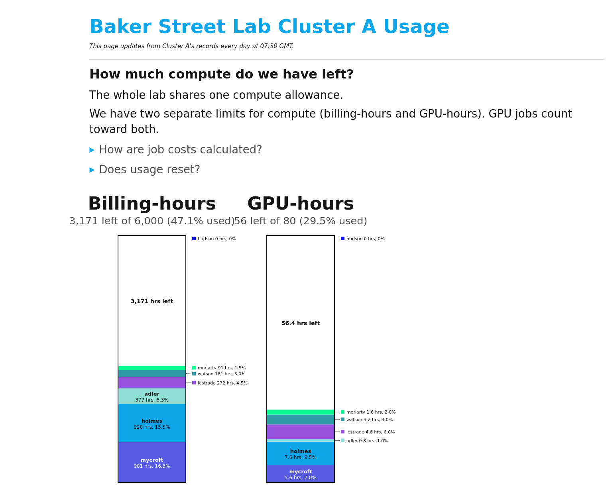
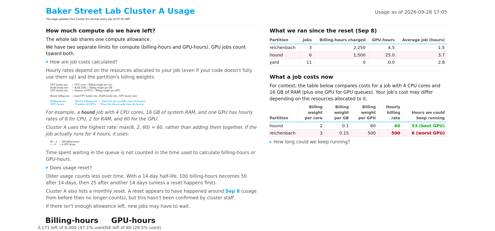

A simple HTML dashboard, updated daily, with details about your lab’s shared compute allocation. It shows how much compute is
left, who's used what, what ran recently, and what a job costs on each partition. A daily `sbatch` job rebuilds it from Slurm's own accounting, and you can host it
wherever you like (ex. a free Cloudflare Pages link). It can optionally post a picture
of the usage bars to your lab's Slack every day at some user-set time.

This tool works on any cluster that
uses Slurm to schedule jobs and track usage.




This is from `demo/`, a fully fabricated example (fictional lab, fictional cluster, fictional
usage) you can run yourself with no Slurm access at all: see [Try it without Slurm](#try-it-without-slurm) below.

## What's in the dashboard?

- How much of the allocation is left. This is illustrated with two usage bars (billing-hours and GPU-hours) broken down by each lab members' specific usage. Colors are
  generated from one accent color you pick.
- What ran since the last reset (or the past 30 days, if the cluster doesn't reset usage), by
  partition: (how many jobs, billing-hours, GPU-hours, and average job length per partition)
- What a job costs right now: for a reference job size you choose, the billing rate and how long
  you could keep running it on each partition, with the cheapest and priciest GPU partitions
  colored green to red.
- _Dropdown_ explanations of how billing-hours and GPU-hours are calculated and whether usage resets,
  with the equations typeset when Node.js is available, plain text otherwise.



## What info does this need to work?

This assumes a standard Slurm setup:

- An account with a `billing` component in `GrpTRESMins` (`sacctmgr show assoc where
  account=<acct> format=GrpTRESMins` returns something with `billing=...` in it). This is
  required: it's the one number this whole tool is built around.
- `TRESBillingWeights` configured on your partitions (`scontrol show partition` shows
  `TRESBillingWeights=...`)

A GPU-hours cap is detected automatically, not assumed: the builder checks whether `GrpTRESMins`
also has a `gres/gpu` component and shows a second bar only if it does. On an account with just a
billing cap (no separate GPU-hours limit), the page adapts to a single bar and adjusts its
wording, rather than crashing or showing a broken all-zero GPU bar. This is genuinely detected
per-account at build time, so you don't need to know in advance which kind of account you have,
the same `setup.sh`/`config.env` works either way.

Note this only covers clusters whose usage accounting runs through Slurm's own TRES/billing
system. A cluster that tracks its allowance a completely different way, for example a separate
"service units" ledger maintained outside Slurm's own accounting, isn't something this tool can
discover on its own; it would need someone to say what command/output that system actually uses,
so an adapter could be written for it specifically. If you're not sure which kind your cluster is,
run the `sacctmgr` command above yourself and see what comes back.
- Read access to `sacctmgr`, `sshare`, `sacct` and `scontrol` for that account. This is just the same info `sshare -A <acct>` already shows you.
- Python 3, and a login or submit node to run the daily job from.

Optional, not required:
- Node.js (any recent version), for typeset equations (KaTeX) instead of plain LaTeX text.
- Firefox or Chrome/Chromium, headless, only needed for the Slack post (it screenshots the bars).
- A free Cloudflare account, for hosting at a public but unlisted link. You can skip this and use
  the local `index.html`, or host it some other way.
- A Slack app/bot, for the daily post into a channel.

## Setup

```
git clone https://github.com/sdharma5/hpc-usage-dashboard.git
cd hpc-usage-dashboard
./setup.sh
```

The wizard asks about your lab, cluster, account and colors, and optionally walks through
Cloudflare Pages and a Slack bot. It writes `config.env` (see `config.example.env` for what each
setting does; no secrets go in that file), generates `refresh_daily.sbatch` for your cluster, and
can build the page and submit the daily job right away. Re-run it any time to change an answer.

Credentials never go in the repo. They're saved outside it, in
`~/.config/<APP_SLUG>/{cloudflare,slack}.env`, each chmod 600.

### Setting up by hand

```
cp config.example.env config.env    # edit it
mkdir -p logs
sed -e "s|@@APP_SLUG@@|myapp|g" -e "s|@@ACCOUNT@@|myacct|g" -e "s|@@PARTITION@@|general|g" \
    -e "s|@@ROOT@@|$PWD|g" -e "s|@@REFRESH_HOUR@@|06:00|g" -e "s|@@PYTHON@@|$(command -v python3)|g" \
    bin/refresh_daily.sbatch.template > refresh_daily.sbatch
python3 bin/build_usage_page.py     # builds index.html once, to check it
sbatch refresh_daily.sbatch         # runs now, then re-schedules itself daily
```

### Try it without Slurm

`demo/` is a fully fabricated example, a fictional lab and cluster, with no real data and no
Slurm access needed:

```
cd demo
./run_demo.sh
```

Open the `index.html` it writes in that folder. It works by putting stand-in
`sacctmgr`/`sshare`/`sacct`/`scontrol` scripts (`demo/fakebin/`) ahead of the real ones on `PATH`,
so the actual, unmodified builder runs against fabricated data instead of a real cluster. See
`demo/README.md` for how it's put together.

## How does the daily refresh work?

Most shared clusters don't allow a user's own cron or scrontab, so `refresh_daily.sbatch`
resubmits itself, one job at a time, chained day after day. Each run does four things in order:

1. Queues tomorrow's run for the time you set in setup (happens first to prevent a failed run from stalling future runs).
2. Rebuilds the dashboard page: polls Slurm (`sacctmgr`, `sshare`, `sacct`, `scontrol`) for the account's
   caps, current usage, recent jobs, and partition weights, and regenerates `index.html` from
   scratch.
3. Uploads the new page to Cloudflare, if that's configured.
4. Posts the usage bars to Slack, if that's configured.

Nothing is scheduled outside Slurm itself: there's no cron, no external timer, no server running
between refreshes. Between runs, the page just sits there as a static file until the next job
wakes up and rewrites it.

Check it's running: `squeue -u $USER -n <APP_SLUG>-daily`

Stop it: `scancel -u $USER -n <APP_SLUG>-daily` (this cancels the waiting future run; there's
nothing else to clean up)

## How is usage computed?

- Caps: `sacctmgr show assoc ... format=GrpTRESMins`, converted from minutes to hours.
- Current usage: `sshare -A <acct> -a`, Slurm's own decayed usage total per person, the same
  number Slurm uses to throttle new jobs.
- Reset detection: your cluster may reset usage on a schedule (`PriorityUsageResetPeriod`). Slurm
  doesn't expose the last reset date directly, so the page infers it: it tests every possible
  start date over the last 100 days against the account's job records, fading old jobs by the
  cluster's own decay half-life, and keeps whichever date best reproduces Slurm's current total.
  This "reset date" is inferred, i.e. it's preferable to use an _actual_ reset date given by your
  cluster admins.
- Job cost table: `scontrol show partition` for `TRESBillingWeights`, applied to the reference
  job size from setup, using Slurm's own max() billing rule.

## Customizing

- Colors: set `ACCENT` in `config.env`; the rest of the per-person palette is generated from it
  automatically. Each person keeps the same color from day to day (`user_colors.json`, regenerated
  each run, not meant to be hand-edited).
- Reference job size, refresh time, account, and which partition the daily job runs on: all in
  `config.env`; re-run `./setup.sh` or edit the file and rebuild. Which partitions *appear* on the
  page isn't something you set: that's automatic, from whichever ones have `TRESBillingWeights`.
- Wording: `bin/build_usage_page.py` is one plain Python file generating HTML strings, with no
  templating engine, so any sentence on the page is a string you can search for and change.

## Files

```
config.example.env             every setting, documented (copy to config.env)
setup.sh                       interactive setup wizard
bin/build_usage_page.py        builds index.html / index_artifact.html / bars_only.html
bin/deploy_cloudflare.sh       uploads index.html to Cloudflare Pages (skips if unset)
bin/post_slack.py              posts bars_only.html as a PNG to Slack (skips if unset)
bin/refresh_daily.sbatch.template   filled in by setup.sh, becomes refresh_daily.sbatch
math/                          KaTeX (render_cli.js + its CSS); npm install here for KaTeX
docs/SLACK_SETUP.md            step-by-step Slack app setup
docs/CLOUDFLARE_SETUP.md       step-by-step Cloudflare Pages setup
docs/screenshots/              screenshots used above, from demo/
demo/                          fully fabricated example; see demo/README.md
```

After setup, your install also has (all git-ignored, all local/generated): `config.env`,
`refresh_daily.sbatch`, `index.html`, `index_artifact.html`, `bars_only.html`, `bars.png`,
`user_colors.json`, `slack_last_file.json`, `logs/`.

## License

MIT, see `LICENSE`.
